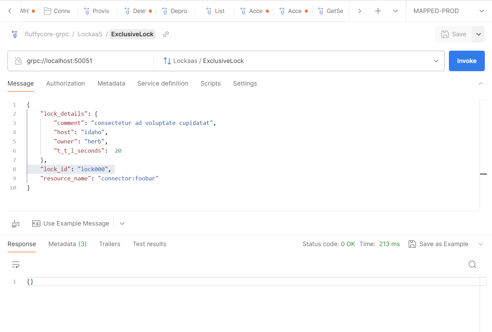

# fluffycore-lockaas

grpc wrapper for [mongo-lock](https://github.com/square/mongo-lock) packaged in a docker-image.

## Protos

The [lockass.proto](./proto/lockaas/lockaas.proto) file is the proto file that defines the service.

 

Note: I had to run bash on windows so I could pass `./api/proto/**/*.proto`

```bash
go install github.com/grpc-ecosystem/grpc-gateway/v2/protoc-gen-grpc-gateway@latest
go install github.com/grpc-ecosystem/grpc-gateway/v2/protoc-gen-openapiv2@latest
go install google.golang.org/protobuf/cmd/protoc-gen-go@latest
go install google.golang.org/grpc/cmd/protoc-gen-go-grpc@latest
go install github.com/fluffy-bunny/fluffycore/protoc-gen-go-fluffycore-di/cmd/protoc-gen-go-fluffycore-di@latest
```

```bash
go get github.com/fluffy-bunny/fluffycore

protoc --go_out=. --go_opt paths=source_relative --grpc-gateway_out . --grpc-gateway_opt paths=source_relative --openapiv2_out=allow_merge=true,merge_file_name=proto:./proto --go-grpc_out . --go-grpc_opt paths=source_relative --go-fluffycore-di_out .  --go-fluffycore-di_opt paths=source_relative,grpc_gateway=true  ./proto/lockaas/lockaas.proto
```

## Docker Build

```bash
docker build --file .\build\Dockerfile . --tag fluffycore.lockaas:latest
```

## Health check

[go-healthcheck](https://github.com/phramz/go-healthcheck)

```yaml
COPY --from=gregthebunny/go-healthcheck /bin/healthcheck /bin/healthcheck
ENV PROBE='{{ .Assert.HTTPBodyContains .HTTP.Handler "GET" "http://localhost:50052/healthz" nil "SERVING" }}'
HEALTHCHECK --start-period=10s --retries=3 --timeout=10s --interval=10s \
CMD ["/bin/healthcheck", "probe", "$PROBE"]
```

Now all that is needed for another service to check health is a `condition: service_healthy`

```yaml
whoami:
  container_name: whoami
  extends:
    file: ./docker-compose-common.yml
    service: micro
  image: containous/whoami
  security_opt:
    - no-new-privileges:true
  depends_on:
    starterkit:
      condition: service_healthy
```

## Docker Compose

```bash
docker-compose -f .\docker-compose.yml up -d
```

## Swagger

[echo-swagger](https://github.com/swaggo/echo-swagger)

We want to swag init the general dir first, which is in the cmd/server directory. Then we want to include the swaggers in the internal

```bash
cd cmd/server
swag init  --dir ./,../../internal
```

## Database Migrations

**IMPORTANT**: run the migration before making any calls to the Car service. It will create the collection and indexes.

This service uses the repository pattern. The responsibility of the repository is to manage the database. The repository is a grpc server that impliments the provided service protos. In this case the CarService is the repository.

A mongo based implementation repository is provided.

The migration files are in the [Dockerfile](./build/Dockerfile)

```yaml
COPY dbmigrate                  /app/dbmigrate
```

You can copy any number of migration folders from any db you want. i.e. if you have postgres, put a postgres folder in the dbmigrate local folder. Then reference it using the `--database` parameter in the command below.

```bash
go run .\cmd\server\ migrate --source file://dbmigrate/mongo --database mongodb://localhost:27017/lockaas --verbose up
```

## Usage

I am using postman.
  

### Exclusive Lock

```json
{
    "lock_details": {
        "comment": "consectetur ad voluptate cupidatat",
        "host": "idaho",
        "owner": "herb",
        "t_t_l_seconds":  20
    },
    "lock_id": "lock000",
    "resource_name": "connector:foobar"
}
```

**SUCCESS**  

```json
{}
```

**FAILURE**  

```error
Status code: 6 ALREADY_EXISTS
```
